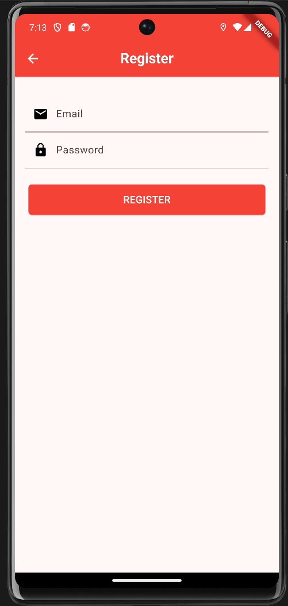
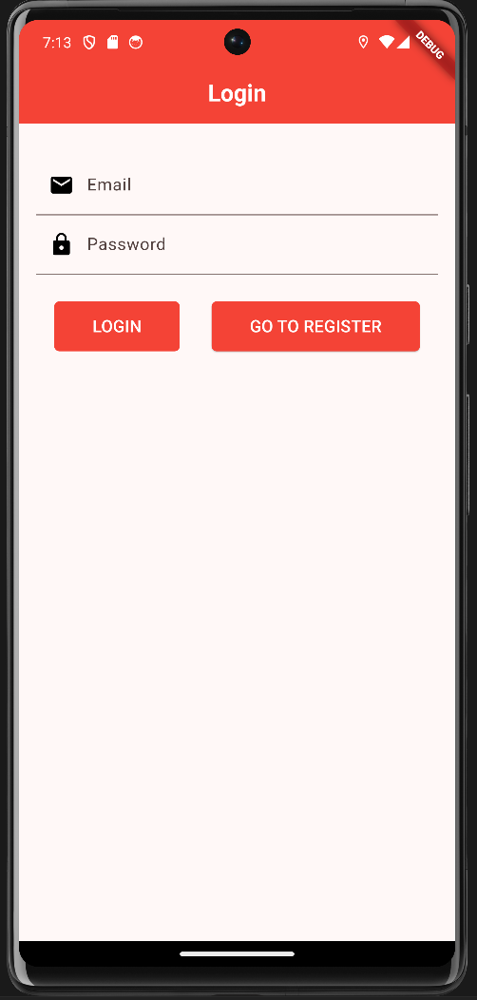
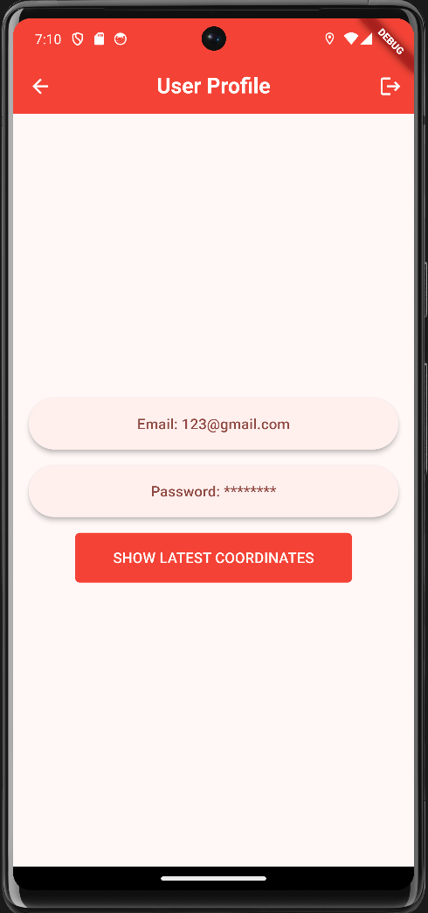
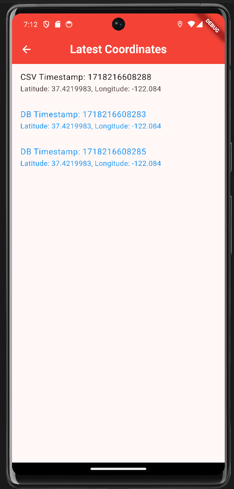
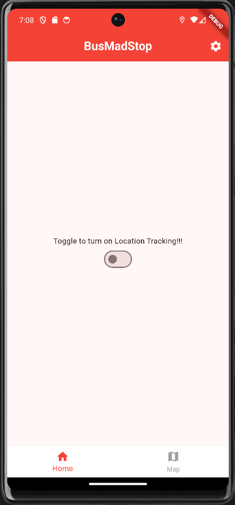
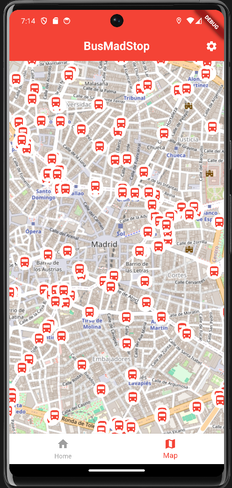
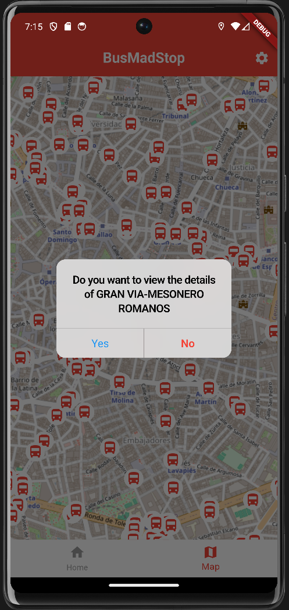
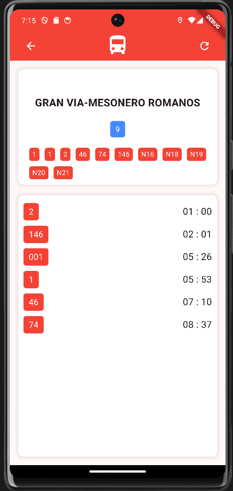
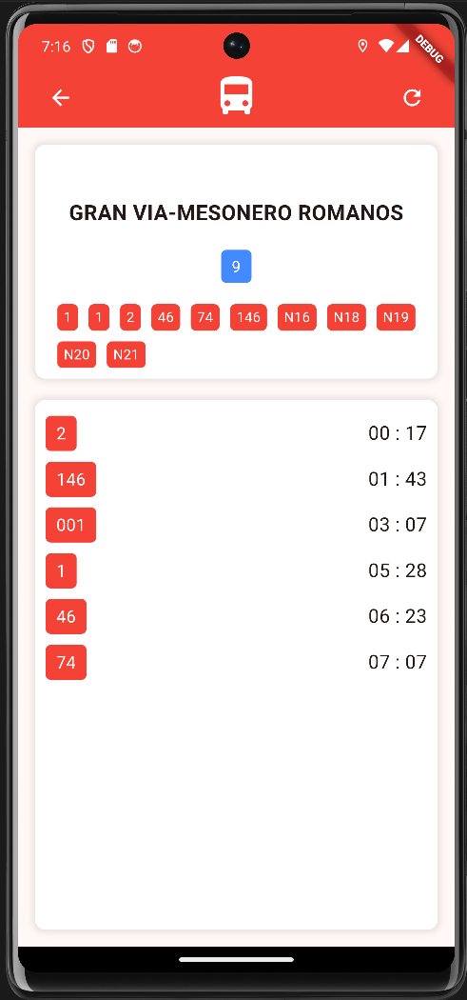
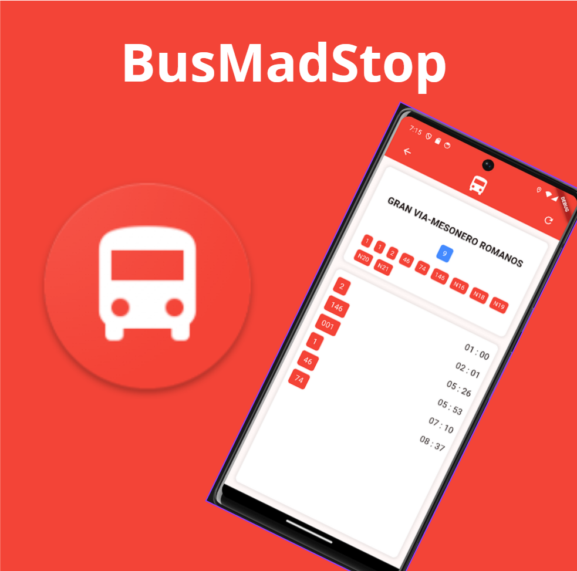

# BusMadStop

## Workspace

Github:

- Repository: https://github.com/kzzazzk/Flutter-BusMadStop/tree/main
- Releases: https://github.com/kzzazzk/Flutter-BusMadStop/releases

Workspace: https://upm365.sharepoint.com/sites/MAD_ZLS_SBM/SitePages/Tracking.aspx

## Description

BusMadStop is an intuitive and user-friendly application designed to enhance your travel experience
in Madrid. It provides real-time information on all bus stations and their respective schedules,
ensuring you never miss a bus. Whether you're a resident or a tourist, BusMadStop makes navigating
Madrid's bus system a breeze.

## Screenshots and navigation

<table>
  <tr>
    <td>
      
      
RegisterScreen

    </td>
    <td>
      
      
LoginScreen

    </td>
  </tr>
  <tr>
    <td>
      
      
UserProfileScreen

    </td>
    <td>
      
      
LatestCoordinatesScreen

    </td>
  </tr>
  <tr>
    <td>
      
      
HomeScreen

    </td>
    <td>
      
      
MapScreen

    </td>
  </tr>
  <tr>
    <td>
      
      
CupertinoAlertDialog

    </td>
    <td>
      
      
BusStopScreen

    </td>
  </tr>
  <tr>
    <td>
      
      
BusStopScreenAfterRefresh

    </td>
  </tr>
</table>

## Demo Video

Video demonstrating how the app works (Max 1 video of 1 minute), upload it to a platform like
YouTube or Vimeo (it might also work with Stream) and link it here:  

## Features

List the **functional** features of the app. For example:

-R Register, login and logout.
- 

- Search for common routes in Madrid.
- Filters by transport type.
- Interactive maps.
- Real-time traffic information.

List the **technical** features of the app. You might include specific references to source code
in your repo. For example:

- Persistence in csv/text file
- Persistence in shared preferences
- Persistence in Room database.
  Ref: [Source code](https://github.com/btabuenca/HelloWorldKt/blob/268a3367296238c76ec1baa18d0b5d268a49235f/app/src/main/java/es/upm/btb/helloworldkt/persistence/room/LocationEntity.kt#L6 "LocationEntity")
- Firebase Realtime database
- Firebase authentication
- Maps: Openstreetmaps or Google maps
- Resful APIs used (*e.g., Openwheathermaps https://openweathermap.org/api .Describe the api here*).
- Menu: *e.g., Toolbar*
- Images: *e.g. glide or picasso library*
- Sensors: *e.g., GPS coordinates, noise meter, light meter, compass, gyroscope, ...*
- ...

## How to Use

Provide instructions on how to get started with the app as user.

## Participants

List of MAD developers:

- Zakaria Lasry Sahraoui (z.lsahraoui@alumnos.upm.es)
- Salman Bourhim Mesaoudi (s.bourhim@alumunos.upm.es)  

